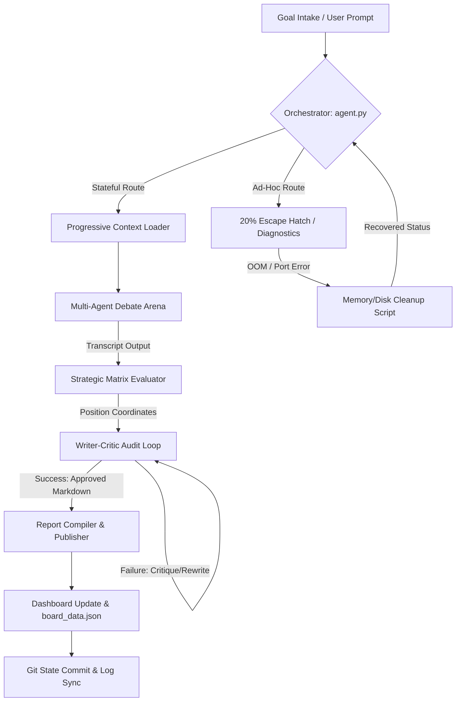

# System Architecture Specification

This document provides a technical specification of the Agent-Native Development Laboratory's multi-agent architecture. It serves as a computer science reference for study, debugging, and framework expansion.

---

## 🗺️ System Dataflow & Loop Consensus

The execution pipeline transitions from qualitative debate to quantitative coordinate mapping, followed by deterministic critic-audited publishing.

---

## 🔀 The Dual-Routing Paradigm

The architecture employs a **Dual-Routing Model** to balance strict workflow reproducibility with agent problem-solving capabilities:

1. **Stateful Pipeline Mode**:
   - Enforces execution tracking via `.agent/state.json`.
   - Constrains the agent's context window by parsing `.agent/context_manifest.json` and injecting only the target dependencies needed for the active step.
   - Prevents prompt fatigue, hallucinations, and high token costs.

2. **Free-Form Sandbox Mode (The 20% Escape Hatch)**:
   - When environmental failures (OOM warnings, locked ports, system errors) occur, the agent temporarily breaks out of the stateful pipeline.
   - It executes local diagnostic tools (e.g. `SERVICES/cleanup_memory.sh`) to restore stability, then resumes the stateful contract thread without losing overall pipeline state.

---

## 🛠️ Multi-Agent Persona Segregation

Each module of the research cycle is isolated to specialized agents with distinct cognitive instructions:

* **The Debate Panel (`PLAYERS/`)**:
  - **Bull Persona**: Maximizes market disruption potential, protocol advantages, and growth upside.
  - **Bear Persona**: Identifies technical vulnerabilities, adoption friction, and integration risks.
  - **Arbitrator Persona**: Assesses arguments, calculates final consensus scores, and writes transcripts.
* **The Heuristic Critic (`SERVICES/run_03_critic_loop.py`)**:
  - Enforces hard programmatic checks (length thresholds, reference link validation, ban on placeholder terms like `TODO`/`FIXME`).
